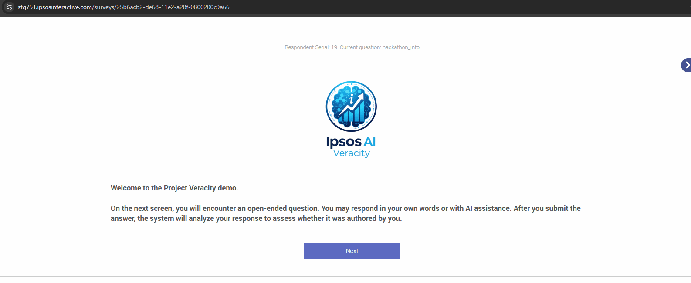

# 🤖 Project Veracity: A Scalable, Real-Time AI Text Detection System

**Project Veracity** is an enterprise-grade, scalable system designed to identify AI-generated text in real-time. Built as a proof-of-concept for **Ipsos**, it provides a robust solution to ensure the authenticity of open-ended survey responses, protecting data quality and research integrity in the age of generative AI.

The system is architected as a set of decoupled microservices, containerized with Docker, and exposed securely via an Nginx reverse proxy, making it a cloud-ready and production-worthy solution.

---

## 🎬 Live Demo



---

## ✨ Key Features

-   **🧠 Advanced NLP Model:** Utilizes a fine-tuned DistilBERT transformer model for high-accuracy stylometric analysis.
-   **⚡ Real-Time & Asynchronous:** The API provides an instant response, while a scalable backend of Celery workers performs the analysis without blocking the user.
-   **📊 Intuitive Dashboard:** A clean, professional user interface built with Streamlit, featuring a custom HTML/CSS result card for a polished user experience.
-   **📈 Monitoring Dashboard:** A separate, live dashboard to track all queries, predictions, and performance metrics like response time.
-   **🔐 Secure & Scalable Architecture:**
    -   **Nginx Reverse Proxy:** Provides a single, secure HTTPS entry point for the entire application.
    -   **User Authentication:** A complete login, registration, and session management system using `streamlit-authenticator`.
-   **☁️ Cloud-Ready:** Fully containerized with Docker and designed for easy deployment to cloud platforms like GCP (Cloud Run) or AWS (ECS/Fargate).

---

## 🏛️ System Architecture

The system is built on a microservices architecture, ensuring scalability and separation of concerns. All public traffic is routed through a secure Nginx reverse proxy.

```mermaid
graph TD
    subgraph Browser
        U[User on Survey Page] -->|HTTPS Request| Nginx;
        D[User on Dashboard] -->|HTTPS Request| Nginx;
    end

    subgraph Docker Network
        Nginx -- SSL Termination & Routing --> A[API - FastAPI];
        Nginx --> SD[Dashboard - Streamlit];
        
        A -->|Create Task| R[Redis - Message Broker];
        W[Worker - Celery & Model] -->|Fetch Task| R;
        W -->|Log Result| DB[(SQLite Database)];
        M[Monitoring - Streamlit] -->|Read Logs| DB;
    end

    style U fill:#d5f5e3,stroke:#2ca02c
    style D fill:#d5f5e3,stroke:#2ca02c
    style Nginx fill:#cce5ff,stroke:#007bff